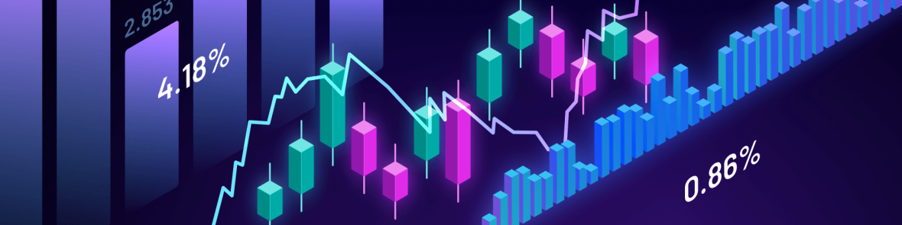

<!-- Optional banner -->

  

# 👋 Hi, I'm Martin Jondeau

🎓 M1 Quantitative Finance @ ESILV (Paris)  
📊 Derivatives pricing, risk management & quantitative research  
💼 Open to 2026 internships (Trading / Sales)

---

## 🚀 Featured Projects

| Project | What it does | Tech |
|---|---|---|
| [Monte Carlo Exotic Options](https://github.com/MartinJondeau/VaR_calculation) | Pricing Asian & Barrier options, **dynamic hedging** + PnL viz | Python, NumPy, Streamlit |
| [Implied Vol Surface & Arbitrage](https://github.com/@USERNAME/implied-vol-surface-arbitrage) | IV computation, **calendar & butterfly** arbitrage checks, 3D viz | Python, Plotly |
| [Value at Risk Framework](https://github.com/@USERNAME/var-risk-framework) | Historical, Parametric, **MC VaR (100k)** + **Kupiec & Christoffersen** | Python, pandas |
| [C++ Pricers for Options](https://github.com/@USERNAME/cpp-derivatives-pricers) | Black-Scholes, CRR binomial, **American options**, Monte Carlo | C++ |

---

## 🧠 Quant & Tech Skills

- **Derivatives & Risk:** BS/Greeks, MC simulation, hedging, VaR/CVaR, backtesting  
- **Python:** NumPy, pandas, scikit-learn, Plotly/Matplotlib, Streamlit/Dash, Pytorch 
- **C++:** performant pricers & numerical methods  
- **Data:** time series pipelines, validation, reproducibility (seeds, tests)

---

## 📎 Quick Links
- 🔗 **LinkedIn:** (www.linkedin.com/in/martin-jondeau-44897827a)  
- ✉️ **Contact:** martin.jondeau@gmail.com

---

## 🧪 How I work
- Clean code structure (`src/`, `notebooks/`, `tests/`), **unit tests** for core logic  
- Clear **README** per repo (theory → install → run → results)  
- Visuals first: plots/dashboards to assess model behavior  
- Reproducibility: `requirements.txt` / `pyproject.toml`, seeds, small samples for demo

---

## 🎯 Currently
- Extending MC engine (pathwise delta for hedging)  
- Real-time dashboard for IV surface + arbitrage flags

*Thanks for reading — feel free to open issues or reach out!*
